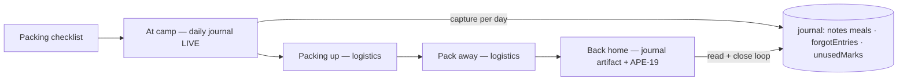

# Batch E — Camp mode + learnings

## Reality check (May 2026)

A large slice already ships in [`index.html`](../index.html) (commit `1ff6ee9` and later stepper work):

| Issue | Plan todo | In code today |
|-------|-----------|---------------|
| APE-16 | `data-model` | `trip.forgotEntries[]`, `trip.unusedMarks[]`, `normalizeTripLearnings`, backup import |
| APE-17 | `camp-mode-ux` | `campLogStrip`, `openCampLogSheet` — **forgot only**; strip on `at-camp`, `pack-up`, `pack-away` |
| APE-23 | `post-trip-ui` | `postTripLearningsHtml` in `postTripBody` — edit, kit, wishlist, link, dismiss |
| APE-15 | `copy-ritual` | Draft copy exists; needs pass after **camp redefinition** |
| APE-19 | `close-loop-later` | Kit + wishlist + link; **no** “include on next trip”, unused→kit suggestions |

**Batch E is not greenfield** — it is **reframe + gaps + emotional polish + APE-19 capstone**.

---

## Emotional north star (unchanged, sharpened)

NeverLeft is a **witness and organizer**, not a scorecard.

| Moment | User feeling | App tone |
|--------|--------------|----------|
| **At camp** | Present, scattered, maybe delighted or annoyed | Quick field notes — no forms, no blame |
| **Packing up / away** | Tired, logistical | Light reminders only; heavy capture belongs on site |
| **Back home** | Reflective, willing to tidy | Calm closure — “for next time”, not “you failed” |

**Learnings** (needed / didn’t use / wishlist) stay a pillar — no guilt, just reminders. The bigger move: **Camp mode becomes a per-day journal** — a memory keeper *and* the practical capture surface, drilling into the emotional connection of camping.

---

## Camp mode = the daily camp journal (v1 direction — co-designed)

### Core idea

**Camp mode** is a **day-by-day journal** for the trip. While in the **At camp** step it is the live “today” page (capture); post-trip the whole journal binds together as the trip’s **memory artifact** (remember). Same data, two moods.

- **On site:** today’s page is the home for quick capture + diary moments.
- **Back home:** read the trip back as a story, then act on learnings (APE-19).

The day spine is **derived for free** from `trip.date` (start) + `trip.nights` — existing helpers `tripDayStart` / end-date math already exist. **Undated trip → single “At camp” page** (graceful fallback).

### Principles (no guilt, never a chore)

- Days are **places things landed**, not boxes to tick — **no streaks, no “you missed a day”, no completion %**.
- Every day **self-populates** (weather, gentle prompt, auto-stamped captures) so a page is **never an empty accusation**.
- All capture optional; diary depth is a bonus, not a requirement.

### What it is NOT

- Not a meal **planner** (recipes → shopping). v1 meals = capture only.
- Not the packing checklist; not a replacement for **While camping** item actions.
- Not a guilt log on every checkbox.

### Journey placement



| Phase | Journal UI |
|-------|------------|
| **at-camp** | **Primary surface.** Day navigator (Day 1…N); today expanded. Per-day: weather, prompt, notes, meals, + learnings capture. |
| **pack-up / pack-away** | **Slim:** “N from your journal to sort” link back; **remove** full capture strip from logistics tabs. |
| **post-trip** | Journal renders **read-first** (the story) + learnings surfaced for APE-19 actions. |

### A day page (at-camp)

Each day card shows, top to bottom:

1. **Header** — `Sat · Day 2` + that day’s **weather** (reuse existing forecast; live or cached).
2. **Gentle prompt** — rotating, contextual, emotional (static library, nothing stored):
   - Day 1: “Settling in — how does camp feel?”
   - Morning: “How did you sleep?”
   - Evening: “Make the most of the campfire tonight.”
   - Last day: “One thing worth remembering?”
3. **Notes** — **multiple entries per day** (a list, not one big field). Each entry is free text (can be one line *or* a paragraph) with timestamp; add / edit / delete. Used as a running diary.
4. **Meals** — **three slots: Breakfast · Lunch · Dinner.** Each slot can be **pre-filled from trip data later** (future meal plan) or just **captured**: *what was had*, *what worked*, *what didn’t*. v1 = light text fields, no planner.
5. **Learnings capture (no guilt):**
   - **Didn’t bring** → `forgotEntries` — “just a reminder, no guilt”.
   - **Didn’t use** → `unusedMarks` — refinement for next time.
   - **Wishlist** → want-list capture (route to existing wishlist resolution).

### Navigation

- **Navigate between days** freely (prev/next or day chips) — so you can add a note/meal to **any** day, including planning ahead (“tomorrow: hike”) or backfilling.
- Today is highlighted; future/past days reachable.

### Copy pillars (APE-15)

| Surface | Energy | Example direction |
|---------|--------|-------------------|
| Journal entry | Present, warm | “Day 2 at camp” |
| Prompt | Gentle, human | “How did you sleep?” |
| Note add | Effortless | “Jot a moment…” |
| Meals | Casual | “What did you cook?” |
| Didn’t bring | No guilt | “Just a reminder for next time” |
| Didn’t use | Refinement | “Fine to leave home next time” |
| Wishlist | Aspirational | “Something to want for next time” |
| Post-trip | Calm closure | “Your trip, looking back” (not a scorecard) |

---

## Data model (APE-16) — evolution

**Keep** `forgotEntries` and `unusedMarks` (post-trip actions + backward compat). Add an optional **`day`** index to new captures so they land on the right journal page (`null` = undated / general bucket).

**Add** per-day journal structures (arrays, consistent with existing flat model):

```js
// Free diary entries — MULTIPLE per day (APE-16)
trip.journalNotes[] = {
  id,
  day,          // 0-based day index from trip.date; null if trip undated
  text,         // one line OR a paragraph — user's choice
  at            // ISO timestamp
}

// Per-day meals — three slots, capture-only in v1
trip.journalMeals[] = {
  id,
  day,                                  // 0-based day index; null = general
  slot,         // 'breakfast' | 'lunch' | 'dinner'
  planned,      // optional, pre-fillable from future meal plan
  had,          // what was actually eaten
  worked,       // what worked
  didnt,        // what didn't
  at
}

// Learnings (existing) gain optional day stamp
forgotEntries[].day ?  // optional, null tolerated
unusedMarks[].day   ?  // optional, null tolerated

// Per-day singletons (one per day) — frozen weather memory, future day mood
trip.journalDayMeta = {
  [dayIndex]: {
    weather: { minC, maxC, code, label, frozenAt },  // snapshot, see below
  }
}
```

**Day derivation helper:** `tripDays(trip)` → ordered list of `{ index, date, label }` from `trip.date`+`trip.nights`; returns single general bucket when undated.

**Migration:** none required. Normalize new arrays/maps on load (default `[]` / `{}`) and in backup import alongside `forgotEntries` / `unusedMarks`. Old trips simply have empty journal.

**Photos:** **deferred to a later iteration** (biggest storage/scope jump) — design leaves room for `journalNotes[].photoIds` later.

---

## Weather: offline-first + frozen memory (resolved)

The app **already stores weather offline** — `trip.weather` is a snapshot `{ mode, summary, fetchedAt, source, days[] }` in localStorage, each day `{ date, minC, maxC, rainMm, windKmh, code (WMO), label }`, fetched from open-meteo via *Save forecast*. No new offline system needed.

**Journal weather rules:**

| Day state | Source | Behaviour |
|-----------|--------|-----------|
| **Future** day | `trip.weather.days[]` matched by `date` (or live refresh if online) | Forecast — may change; refreshable |
| **Today / past** day | **Freeze** into `journalDayMeta[day].weather` on first view/capture | Memory — survives refresh, clear, offline |

- **Online:** live/snapshot forecast for upcoming days (existing *Save forecast* flow).
- **Offline:** last saved snapshot (already works) + any frozen journal-day weather.
- **Why freeze:** a forecast is meant to change; a memory is not. Freezing once a day is current/past keeps the diary truthful.
- Reuse `wmoWeatherLabel(code)` and existing icon mapping (`tripHeroWeatherIcon` logic) for per-day display.

---

## Dynamic prompts engine (resolved direction)

Prompts are **contextual**, not a fixed rotation — derived from data already on the trip, so they rarely feel repetitive.

### Context built per day (`buildPromptCtx(trip, dayIndex)`)

```js
ctx = {
  dayIndex, dayCount, isFirst, isLast, isMiddle,
  partOfDay,   // 'morning'|'afternoon'|'evening'|'night' — clock, only when day === today; else null
  season,      // trip.season
  weather: {   // from frozen/snapshot day
    code, band,      // band: clear|cloud|fog|rain|snow|storm (from WMO code)
    maxC, minC,
    hot, cold, frost, wet, windy
  },
  place,       // trip.venue.name || null
  activities,  // resolved trip.activities[]
  people: { count, names[], solo, group, hasKids, hasPartner, hasDog, dogName }
}
```

Signal sources: `weather.days[]`, `trip.season`, `trip.venue.name`, `trip.activities[]`, `tripRosterPeople` / `effectiveTripAttendeeIds` / `trip.dog` / `findLikelyDogPersonId`, day index vs `trip.nights`, real clock.

### Template schema

```js
{ id, text, when:(ctx)=>bool, weight:1, tags:[] }
```

- `text` supports tokens: `{place}`, `{firstName}`, `{dog}`, `{dayNum}`.
- No `when` ⇒ always-eligible **generic** baseline.

### Selection algorithm

1. Build `ctx` for the day.
2. Keep templates where `when(ctx)` is true + the generic pool.
3. **Weight condition-specific higher** than generics (relevant surfaces, variety stays).
4. **Seed pick by `tripId + dayIndex + date`** → stable within a day (no flicker on re-render); offer a small **“another prompt”** reshuffle.
5. Track a short ring of recently-shown ids (per trip) to avoid near-term repeats.
6. Interpolate tokens; fall back to a safe generic if a token is missing.

### Library shape (grows over time)

| Pool | Trigger | Examples |
|------|---------|----------|
| Generic | always | “What mattered today?” · “A small moment from today?” |
| Position | first / last / middle | “First night at {place} — how does it feel to arrive?” · “Last morning — one thing worth remembering?” |
| Time | morning / evening | “How did you sleep?” · “Make the most of the campfire tonight.” |
| Weather | rain / cold / hot / wind / snow | “Rain at camp — how are spirits holding up?” · “Cold one last night — how did you sleep?” · “Breezy out — everything still pegged down?” |
| People | dog / kids / partner / solo / group | “How’s {dog} settling into camp?” · “What did the kids get up to today?” · “Quiet solo night — what’s on your mind?” |
| Place | venue named | “What’s the view like at {place} today?” |
| Activity | hiking / swimming / etc. | “Big walk planned — how are the legs?” |

~6–8 generics + condition pools → dozens of combinations from a modest, extendable library.

---

## Issue-by-issue delivery

### 11 — APE-15 Copy ritual (first, cheap)

- Audit all Camp + post-trip strings after redefinition.
- Differentiate **at-camp** strip vs **pack-up/away** (if strip remains).
- Toast: keep “Logged — review when you’re home”.

### 12 — APE-16 Data model (daily journal)

- Add `trip.journalNotes[]`, `trip.journalMeals[]`, `trip.journalDayMeta{}`; optional `day` on `forgotEntries` / `unusedMarks`.
- `tripDays(trip)` day-spine helper (date+nights → ordered days; undated → single bucket).
- **Weather freeze:** snapshot `weather.days[]` (matched by date) into `journalDayMeta[day].weather` once a day is today/past.
- Normalize on load + map in backup export/import alongside learnings.

### 13 — APE-17 Daily journal (camp entry + capture)

- **Home:** `at-camp` tab becomes the **day journal** — day navigator + per-day card.
- **Per day:** weather (live future / frozen past), **dynamic prompt**, **multiple notes**, **three meal slots** (had/worked/didn’t), learnings capture (didn’t bring / didn’t use / wishlist).
- **Dynamic prompts:** `buildPromptCtx` + template library + seeded weighted pick + “another prompt”.
- **Weather:** match journal day → `weather.days[]` by date; live refresh online, frozen/snapshot offline.
- **Navigate** between days to add notes/meals to any day.
- **Slim** `campLogStrip` on pack-up/pack-away → link back to journal (no full capture there).
- Reuse `addForgotEntry`, `addUnusedMark`; add note/meal handlers.

### 14 — APE-23 Post-trip journal + learnings UI

- Render journal **read-first** (the story: days, notes, meals) + learnings block.
- Surface forgot/unused for resolution; bridge copy “you logged this on site”.
- Polish unused row actions if any gaps.

### 15 — APE-19 Full close-the-loop (capstone)

| Action | Status |
|--------|--------|
| Forgot → Add to Camping Kit | Done |
| Forgot → Want list | Done |
| Forgot → link to checklist line | Done |
| Forgot → dismiss | Done |
| Forgot → **Include on next trip** (`manualIncludeIds`) | **Build** |
| Unused → suggest lower qty / template hint | **Optional v1** — copy-only hint or “Review in kit” link |
| Unused → **exclude from default template** | Defer unless simple `excludedItemIds` affordance exists |
| Camp “worked well” → pin to item notes | Defer v2 |

---

## Out of scope for Batch E (park for later iteration)

- **Photos** in journal entries (next iteration; data model leaves room).
- Meal **planner** (recipes, ingredients → shopping list); v1 meals = capture only.
- Activity scheduler.
- Auto-changing `qtyRule` from learnings (qty batch F).
- Linking journal to `venue.siteNotes` (trip hub follow-up).
- React migration.

---

## Test plan (sign-off before Linear Done)

1. **At camp (dated trip):** day navigator shows Day 1…N; add multiple notes to a day; add breakfast/lunch/dinner capture; navigate to another day and add a note there.
2. **No-guilt learnings:** log didn’t bring, didn’t use, wishlist from a day; appears in post-trip.
3. **Undated trip:** single journal bucket works (no broken day math).
4. **pack-up/away:** logistics tabs are clean; journal reachable via slim link.
5. **Post-trip:** journal reads back as a story; resolve forgot → kit / wishlist / **next trip include**; undo works.
6. **Backup:** export/import preserves `journalNotes`, `journalMeals`, `journalDayMeta`, `forgotEntries`, `unusedMarks`.
7. **Weather offline:** with no connection, past/today days show frozen weather; refreshing forecast later does not change a past day.
8. **Prompts:** vary by weather/roster/day — rainy day, dog-along, first night, last morning each surface fitting prompts; stable within a day; “another prompt” reshuffles.
9. **Copy:** no blame anywhere; prompts feel warm; post-trip feels like closure.

---

## Resolved decisions (co-design, 29 May 2026)

- **Meals:** three slots (B/L/D); each pre-fillable from trip data later, else capture had / worked / didn’t.
- **Days:** navigate freely; add notes/meals to any day (plan ahead or backfill).
- **Notes:** multiple entries per day (list), each can be a line or a paragraph.
- **Per-day info:** weather + gentle emotional prompts (sleep, campfire, settling in…).
- **Weather:** online = live fetch; offline = stored snapshot (already supported); **freeze** weather onto today/past journal days so the memory can’t be rewritten by a later forecast refresh.
- **Prompts:** **dynamic**, built from weather / place / roster / day-position / time signals via a `when(ctx)` template library with weighted, seeded selection — not a fixed rotation.
- **Learnings kept:** didn’t bring (no guilt), didn’t use, wishlist — fine for v1.
- **Photos:** deferred to a later iteration.

## Open questions (minor — decide at build)

1. **Prompt seen-history:** persist recently-shown ids on the trip vs in-memory only (persist = better cross-session variety, tiny storage)?
2. **“Another prompt” control:** always available, or only when the day has no notes yet (avoid nudging once they’ve written)?
3. **Item actions `during`:** keep as-is; journal complements, does not duplicate.

---

## References

- Feature plan: [forgotten_item_feature_ux_d218206d.plan.md](forgotten_item_feature_ux_d218206d.plan.md)
- Backlog: [backlog_batches_wave1_wave2.plan.md](backlog_batches_wave1_wave2.plan.md) Batch E
