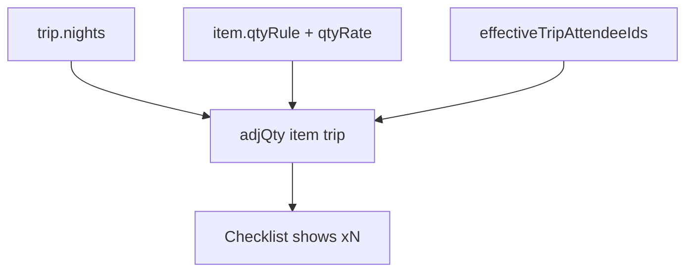
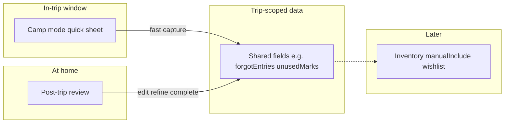

# Demo data mode — blueprint to “my kit” without wiping

## Current behaviour (today)

In [`index.html`](index.html):

- **First launch** (no saved state): `load()` runs `demoData()`, saves to `localStorage` (`SK`), sets **`localStorage.basecamp_demo = '1'`** (~1004–1008).
- **Demo banner** shows while that flag is `'1'` (~1033–1037); copy pushes **“Clear demo data”** (~707–711).
- **`clearDemoData()`** → **`resetAllData()`**: wipes **all** `localStorage`, empty kit + default settings (~1050–1062). Demo flag goes away only because everything is cleared — **no path to keep edited sample data and exit demo**.
- **`loadDemoDataAgain()`** in Settings replaces live data and **re-sets** the demo flag (~1065–1073).

So the product today treats demo as **temporary disposable data**, not a **starting blueprint** — even though editing demo in place already works technically (it is saved in `SK` like real data).

## Product decision (recommended)

**Default happy path:** first load = **rich sample kit you can edit** (rename people, delete fake trips, tweak items). Demo is a **template**, not a sandbox you must escape by deleting everything.

**Secondary path:** **Start empty** for users who want zero noise — keep `resetAllData()` but de-emphasise vs “use as my kit”. **Must pass mandatory backup gate first** (see below) — no exceptions.

**Graduation** = one explicit action that means: *this is my real data now* — **no data deletion**, only **clear the demo flag** (and UX that stops treating the app as “sample mode”).

## How to go from demo → my data (implementation concept)

**Single function, e.g. `graduateFromDemo()`:**

1. `localStorage.removeItem('basecamp_demo')` (or set to `'0'` — prefer **remove** so “unset” = user data).
2. Optional: persist in exported state for clarity:
   - `S.meta = { dataSource: 'user', graduatedAt: ISO date }` (new; migrate missing as user data).
3. Dismiss demo banner; `save()` unchanged — **same `S.items/trips/people/settings`**.
4. Short confirmation toast: “This is your kit now.”

**Do not** clone or rewrite IDs on graduation — unnecessary; the data is already “theirs” once they edit. Graduation is **metadata + messaging**, not a migration of entities.

**When to offer graduation (UX):**

- **Primary CTA on demo banner:** “**Use as my kit**” (replaces or sits above “Clear demo data”).
- **Settings → Data:** same action + keep “Start fresh” and “Reload demo” as separate, scary/explicit actions.
- **Optional soft nudge (later):** after first meaningful edit (e.g. renamed a person, added an item) — non-blocking toast: “Looks like you’re making this yours — [Use as my kit]” — **never auto-graduate** without consent.

**Reload demo** must stay **opt-in only** (confirm: replaces current data) and must set `basecamp_demo` again — distinct from graduation. **Also behind mandatory backup** — replacing live data is destructive.

**Backup / import:** restoring a user backup should **not** set demo flag unless file is explicitly a “demo seed” export (if you ever add that). Normal import = user data.

## Mandatory backup before wiping data (no exceptions)

**Rule:** Any action that **deletes or replaces** the user’s current kit in `localStorage` must not run until the user has completed a **backup in that same flow**. No “skip”, no “I already backed up” checkbox, no bypass for demo vs real data.

**Applies to (route all through one gate, e.g. `confirmDestructiveWithBackup({ title, body, onConfirmed })`):**

| Action | Today | Destructive? |
|--------|-------|----------------|
| `resetAllData()` | Settings “Start fresh” | Yes — full wipe |
| `clearDemoData()` | Demo banner | Yes — calls reset |
| `loadDemoDataAgain()` | Settings “Reload demo” | Yes — replaces current `S` |

**Does not require backup:**

- **`graduateFromDemo()`** — no data loss; flag + messaging only.
- Normal edit/save/delete of single items or trips (user can undo via restore backup if they exported earlier).

**UX flow (recommended):**

1. User taps destructive action → **modal** (not a single `confirm()`).
2. Copy explains: data will be lost/replaced; **download or share a backup first**.
3. Primary actions: **Download backup** (`exportData()`) and **Share backup** (`shareBackup()` where supported) — reuse existing [`exportData`](index.html) / `basecamp_last_export` (~4036–4059).
4. After a backup action runs successfully in this session, enable **destructive confirm** (e.g. “Clear all data” / “Replace with demo”) — still require explicit second confirm on the button.
5. If export fails (storage quota, blocked download), **block wipe** and show error — no exception path.

**Implementation notes:**

- Track **backup completed in this gate** with a short-lived flag (e.g. `sessionStorage` key set only when `exportData` or successful `shareBackup` runs from the modal — not from header menu alone unless you treat that as sufficient globally; **stricter:** only unlock from inside the destructive modal).
- Do **not** call `resetAllData()` / replace `S` from banner or Settings without going through the gate — audit all entry points.
- Optional: show **Last backup: …** in the modal from `basecamp_last_export` for context, but **still require** a fresh backup in-flow (user requirement: no exceptions).

**Copy tone:** protective, not punitive — “We’ll help you save a copy first so you never lose your kit by accident.”

## Banner and copy (direction)

| Today | Proposed |
|-------|----------|
| “Demo Mode — sample data… Clear it when ready” | “**Sample kit** — explore or edit anything. When you’re ready, **use it as your kit**.” |
| Primary: Clear demo data | Primary: **Use as my kit** · Secondary: Start empty · Dismiss hides banner only |

Dismiss (✕) can remain **hide banner only** while still demo-flagged, or graduation-only banner — **recommend:** dismiss hides until next session but flag stays until “Use as my kit” OR graduate on first “Use as my kit” only (simplest: dismiss = hide; flag cleared only by graduate).

## Why both paths have value

- **Blueprint path:** low cognitive load — learn features with realistic trips/items, then rename/delete at your pace; one click removes “demo” stigma without losing work.
- **Empty path:** for power users / second household — unchanged `resetAllData()`, clearly labelled **destructive**.

## Out of scope for v1 (optional later)

- Per-record `seededFromDemo` on each item (only needed if you want “remove all original demo lines” without full reset).
- Auto-graduate on edit heuristics without a button.
- Separate demo profile vs user profile in one browser (overkill for local-first app).

---

# Forgotten / overpacked — where it lives and how it behaves

## Product intent (tone)

- **Forgot something**: acknowledge stress without blame (“planned / unforeseen / slipped through”) — the app is a **witness and organizer**, not a scorecard.
- **Too much / didn’t use**: frame as **refinement** (“what we can leave off next time”) — same underlying data as learnings, but **Camp mode** can still capture it in the moment (“we never opened this”) while **post-trip** is where you optionally tidy tags and links.

Avoid making the **pre-departure packing checklist** the primary **regret** surface: that phase is execution-heavy; a separate **Camp mode** channel avoids piling emotional logging onto every checkbox row.

## Camp mode (in-trip): action-oriented capture

**Idea:** While the trip is “live” (after you’ve left for camp / are in the field / on the way home), the UX shifts from long tables to **fast, deliberate actions** — almost a small **“On trip”** console.

**Does it work?** Yes. It matches how people actually feel: at camp you want **two taps and done**, not a post-mortem form. Technically it works cleanly if **Camp mode and post-trip read/write the same trip-scoped structures** (e.g. forgot entries, didn’t-use flags, optional timestamp). Post-trip then becomes **review + enrich** (link to inventory item, classify “not on list” vs “on list but left behind”), not the only place data ever existed.

**Suggested entry points (pick one or combine in implementation):**

- **Floating / sticky control** on the trip view when `trip.status` is in the **in-trip window** (see below): label like **“Log”** or **“On trip”** → opens a **bottom sheet or compact modal** (phone-friendly).
- **Optional chip in the trip header** during that window so it’s discoverable without hunting in tabs.

**In-trip window (align with existing lifecycle in** [`index.html`](index.html)**):**

- **Core:** `pack-up` (“at camp — packing up”) is the clearest **Camp mode** phase.
- **Stretch:** include `pack-away` (back home, still unpacking) if you want captures like “realised we never used X” while putting gear away — still emotional, still action-oriented.
- **Exclude by default:** `packing` (pre-departure) — keep that for checklist flow; optional later if you want “last-second forgot before we left” without opening Camp mode on every planning trip.

**Quick actions inside the sheet (examples — all optional tiles / short forms):**

1. **Needed but don’t have** — one line + optional severity / “not on list” toggle (minimal fields; expand later in post-trip).
2. **Brought it, didn’t use** — quick pick from “on this trip” lines or free text if not worth linking yet.
3. **Reuse existing flows where they fit:** stub toward **left at site** / **damaged** if those already match “something happened now” (same trip keys; Camp mode is the **fast path**, full tables stay in post-trip or existing menus).

**Principle:** Camp mode = **capture impact at the time**; post-trip = **organise and learn** (and “Done — complete trip”).

## Primary home (reflection): Post-trip (“Back home review”)

The natural **closure ritual** remains extending [`postTripBody`](index.html) (~2289–2384): same banner territory as damaged / left behind / consumables. Here users see **everything logged in Camp mode**, can edit, add inventory links, and merge with “Back home review” tasks.

**Suggested data sections (unchanged conceptually):**

1. **Needed but didn’t have** — entries from Camp mode + add/edit here.
2. **Brought but didn’t use** — enrich with checklist links, notes.

**Copy direction:** post-trip subtext can acknowledge “Some of this you may have logged on trip — here’s a moment to tidy it up.”

## Where not to lead with it

- **Trip Notes** (`saveTripNotes`, textarea ~2391): fine as narrative **or** generated summary, not the only structured store.
- **Planning tab:** at most future “last trip learnings” teaser — not primary capture.

## Duration-aware quantities (socks per day, etc.)

**Is it viable?** Yes — and you already have a **thin prototype** in [`index.html`](index.html):

- Trips store **`nights`** (trip modal, default 3).
- **`adjQty(item, trip)`** (~1212–1218) adjusts **consumables** from `trip.nights` using **name-based rules** today (toilet roll ≈ `ceil(n/2)` + remote buffer, gas ≈ `ceil(n/3)`, dog food ≈ `n+1`); everything else uses static `item.qty`.
- The packing checklist already displays **`×${qty}`** when `adjQty` &gt; 1 (`ciRow`, ~2033 / ~2099).

So “account for trip length” is **already possible in this app**; the gap is **generalising** beyond three hard-coded names and **per-person** math (socks × days × people).

**Product framing**

- **Base qty on the item** = “what we keep at home” / default pack size, not necessarily “what we take for a 3-night trip.”
- **Trip qty** = computed at pack time from **nights** (+ rules), shown on checklist and optionally on a **prep / shopping** hint.
- Only apply to lines that **should** scale — typically **`type === 'consumable'`** and/or hygiene / food categories; don’t auto-scale tents, chairs, etc.

**Suggested rule model (item-level metadata, not regex on name)**

Add optional fields on inventory lines (names illustrative):

| Rule | Meaning | Example |
|------|---------|---------|
| `fixed` (default) | Use `item.qty` | Spare rope |
| `perNight` | `ceil(nights × rate)` | 1 sock per night → rate 1 |
| `perPersonPerNight` | `ceil(nights × rate × people)` | Socks for assigned people |
| `perTrip` + formula | Custom e.g. `ceil(nights/2)` | Toilet rolls (existing logic) |
| `buffer` | +1 if `trip.distance === 'remote'` | Matches current toilet/gas pattern |

**People multiplier**

- **Assigned people:** if `item.personIds` has ids, count **intersection with `effectiveTripAttendeeIds(trip)`** (same roster helper as checklist).
- **Unassigned / shared:** count **roster size** or `1` (user choice in rule).
- **`extraPeople`:** trip modal already notes “consumables later” (~867) — when relevant, add to headcount for **shared** consumables only (not per-person kit lines unless you explicitly want guests in the math).

**Where it lives in UX**

1. **Item editor** — “How much for a trip?” → rule dropdown + rate (and optional buffer). Advanced users set once; most items stay `fixed`.
2. **Trip planning / packing** — checklist **`×N`** (already there); optional **“Suggested amounts for this trip”** strip when status is `planning` or start of `packing` (sum of deltas vs home stock → ties to restock).
3. **Camp mode / post-trip** — optional link: **“Ran out”** on a consumable can flag “rule was wrong” (feeds learnings, not auto-changing rules without confirmation).

**Phased implementation (recommended)**

- **Phase 1:** Move existing `adjQty` regex rules into **explicit rules on those demo items**; add **socks** (or one hygiene line) as `perPersonPerNight` proof.
- **Phase 2:** Item editor + migration for `qtyRule` / `qtyRate` on import.
- **Phase 3:** `extraPeople` + prep summary; post-trip “adjust default rate” from ran-out feedback.

**What not to do in v1**

- Don’t auto-rewrite `item.qty` in inventory when nights change (trip-specific number should stay **computed**, base stock stays in inventory).
- Don’t require rules on every line — **opt-in** keeps setup light.

## Closing the loop (later phases)

- From a **forgot** row: Add to inventory / wishlist / manual include pattern (already in app).
- From **didn’t use**: soft suggestions for templates or season/activity — never auto-delete.

## Implementation touchpoints (when you build)

- **Shared model + migration:** trip fields + backup import next to `leftAtSite` / `damaged` (~4218–4246).
- **Camp mode:** gate UI on `trip.status` (`pack-up`, optionally `pack-away`); one sheet component; persist same keys as post-trip.
- **Post-trip:** [`postTripBody`](index.html) renders and edits the same structures; [`packUpBody`](index.html) (or trip shell) hosts the entry FAB/chip.

## Open decisions (when implementing)

- **Camp mode definition (Batch E, May 2026):** Hyper-focused on **At camp** (`at-camp` status) — on-site witness for what worked, gaps, meals/activities as **tagged quick notes**, not logistics on pack-up/away. Detail: [batch_e_camp_learnings.plan.md](batch_e_camp_learnings.plan.md).
- **In-trip window:** **Primary = `at-camp` only** for full camp sheet; pack-up/pack-away TBD (strip removal vs link-back).
- **Camp sheet tiles:** Needed + didn’t use (confirmed) + worked well + quick note with optional tag.
- **Entry pattern:** Header chip and/or at-camp tab hero → multi-tile bottom sheet.
- **v1 cut:** Camp mode + minimal post-trip list **vs** post-trip-only first — recommendation: **define data model once**, ship **Camp mode quick capture + thin post-trip list** in the same slice so nothing is captured twice in different silos.
- **Qty rules vs Camp mode:** can ship **independently**; qty rules reduce “forgot because we packed 3 socks for 7 nights” before you leave. Camp mode still catches what rules miss.
- **In-trip window:** default **`pack-up` + `pack-away`** for Camp mode (capture while packing up camp and while unpacking at home).
- **Demo graduation:** ship as its own small slice (banner + `graduateFromDemo()` + Settings copy); no dependency on Camp mode or qty rules.
- **Backup before wipe:** ship with demo graduation slice (same touchpoints: banner clear, Settings reset/reload).

## Build order suggestion (when implementing)

1. **Demo graduation + mandatory backup gate** — small, unblocks real daily use; protects every wipe path.
2. **Camp mode + learnings data model** — emotional capture.
3. **Qty rules** — builds on stable “my kit” data.
