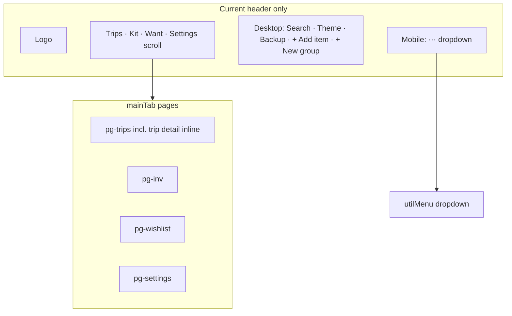

## Decisions (locked)

| # | Topic | Decision |
|---|--------|------------|
| 1 | **Trips badge** | Show **number of trips** (`S.trips.length`; hide when 0; cap display e.g. `9+`) |
| 2 | **Fifth dock slot** | **More…** (not Settings) — opens **util sheet** with Settings, backup, theme, help, etc. |
| 3 | **Trip detail** | **Keep bottom nav visible**; Trips tab stays active; top bar shows ← back |
| 4 | **Centre +** | **Always visible** on every tab (including while Settings is open) — primary creates stay front and centre |
| 5 | **Search** | **Top bar only** — not repeated as a row in the util sheet |
| 6 | **Shell width** | Same dock + top bar on **all viewport widths** (sidebar desktop deferred) |

# Field mobile shell — bottom nav + action sheets

Adopt the **navigation shell** from [`NeverLeftClaudeDesign.html`](../NeverLeftClaudeDesign.html) (“NeverLeft · Field”) into production [`index.html`](../index.html).

**In scope (this plan):** One consistent shell everywhere (phone, tablet, desktop): compact top bar + fixed bottom nav + two sheets (create + more). **Out of scope for now:** Field’s desktop **sidebar + breadcrumb topbar** grid (`nl-app` / `nl-sb` / `nl-topbar` at ≥980px) — plan that as a follow-on once the sheet behaviour is signed off.

Prior comparison (Cursor plan *Claude Design comparison*) already rated bottom nav **low risk / high value**; this file is the implementation spec for that slice.

---

## What the design does

At **≤980px** the Field prototype switches from sidebar layout to:

| Piece | Role |
|-------|------|
| **`nl-mtopbar`** | Sticky top: brand mark + right icons (search, optional “Offline-ready” pill, overflow) |
| **`nl-mnav`** | Fixed bottom bar: **Trips** (badge), **Kit**, centre **+**, **Want list**, **You** (settings) |
| **Page padding** | `padding-bottom: ~100–110px` so content clears the dock |

CSS extracted from the design export (see `scripts/extract_design_nav.mjs`):

- Dock: `position: fixed; bottom: 0`, blur, `safe-area-inset-bottom`, `z-index: 50`
- Tabs: icon + 10.5px label, `.on` in sage, optional rust badge on Trips

**Not fully present in the static HTML blob:** React markup for the + sheet and overflow sheet — behaviour below is **inferred** from prototype navigation + your requirements.

---

## What production does today



| Concern | Today |
|---------|--------|
| Primary nav | Top `.hnav` tabs; Settings hidden on mobile (`#navSettingsBtn { display:none }`) — reached via **···** only |
| Create | Desktop header buttons; mobile **···** lists + Add item / + New group |
| Utilities | Search, backup, theme, shopping list, onboarding replay/tour — split desktop vs **···** |
| Trip open | `activeTripId` — still on Trips tab; header unchanged |
| FAB conflict | `scroll-top-btn` fixed bottom-right (`z-index: 120`) |

Breakpoint today: desktop cluster shows at **≥768px**; design uses **980px** for shell swap.

---

## Target architecture (v1 — same on all widths)

```mermaid
flowchart TB
  subgraph shell [New app shell — all viewports]
    Top[nl-mtopbar: brand or back + search only]
    Main[Existing .page content]
    Dock[nl-mnav: Trips · Kit · + · Want · More…]
  end
  subgraph sheets [Bottom sheets]
    Create[createSheet — contextual + always available]
    Util[utilSheet — from More… dock tab]
  end
  Top -->|search| Search[openSearchPanel]
  Dock -->|Trips Kit Want| setTab
  Dock -->|+| Create
  Dock -->|More…| Util
  Util -->|Settings row| setTab_settings[setTab settings]
  Create --> Existing modals
  Util --> Existing handlers
```

### 1. Bottom nav (`nl-mnav`)

Four primary tabs + centre **+** + **More…** (no Settings tab in the dock).

| Dock tab | Action | Notes |
|----------|--------|--------|
| **Trips** | `setTab('trips')` | Badge: **`S.trips.length`** (updated in `refreshNavBadges` or shell helper); hidden when 0 |
| **Kit** | `setTab('inv')` | Short label “Kit”; tour step 4 retarget to `#dockKitBtn` (or equivalent) |
| **+** (centre) | Open **create sheet** | Always shown; does not switch tab |
| **Want list** | `setTab('wishlist')` | |
| **More…** | Open **util sheet** | Does **not** call `setTab` on tap; sheet includes **Settings** row → `setTab('settings')` then close sheet |

**Active state (`.on`):** Trips / Kit / Want when `mainTab` matches. **More…** `.on` when util sheet is open **or** `mainTab==='settings'` (user is in settings via sheet).

**Hide** legacy `.hdr` nav tabs, desktop cluster, and `#utilMenu` dropdown once parity is verified.

### 2. Create sheet (`createSheet`) — contextual +

Single sheet/popover opened from centre tab. Rows = large tap targets with short subtitles.

**Context matrix** (implement via `getCreateActions(context)`):

| Context | Condition | Actions (in order) |
|---------|-----------|-------------------|
| **Trips list** | `mainTab==='trips'` && !`activeTripId` | New trip → `openNewTripModal()` |
| **Trip detail** | `mainTab==='trips'` && `activeTripId` | Quick add to trip → `openQuickAddModal(activeTripId)`; optionally New trip |
| **Camping Kit** | `mainTab==='inv'` | Add item → `openAddItemModal()`; New group → `openNewGroupModal()` |
| **Want list** | `mainTab==='wishlist'` | Add want list item → `openAddWishModal()` |
| **Settings** | `mainTab==='settings'` | **Common creates** ( + still visible): New trip, Add item, Add want list item — shortcuts so primary actions stay central |
| **Restock** | N/A | Not a dock tab; shopping list remains in util sheet when `rc>0` |

**Not in v1 create sheet** (stay in More or inline UI):

- Add item to group → `openAddSubModal` (keep row **+ Add item to group** in kit table)
- Duplicate / move-to-group (stay row **⋯** menus)

**+ button affordance:**

- Design: elevated centre FAB in dock (wider hit target, sage/dark fill).
- On open: rotate to × or dim dock; backdrop `rgba` click closes (reuse modal overlay pattern).

### 3. Util sheet (`utilSheet`) — opened from dock **More…**

Single sheet for everything that is not primary nav or **+** create. **No search row** (search lives in top bar only).

| Section | Items |
|---------|--------|
| **Navigate** | **Settings** → `setTab('settings')`, close sheet |
| **App** | Dark mode |
| **Backup** | Download, Share, Restore |
| **Help** | Replay intro, Show me around |
| **Shopping** | Shopping list (when restock shortfall / `rc>0`) |

Destructive / data actions (graduate demo, reset, reload demo) stay **inside Settings** UI, not duplicated in the sheet.

### 4. Top bar (`nl-mtopbar`)

| Element | Behaviour |
|---------|-----------|
| Brand | Logo + “NeverLeft” when on list pages |
| Search | **Only** utility icon → `openSearchPanel()` |
| **Trip detail** | `activeTripId`: **← Trips** → `closeTrip()` (bottom nav **stays visible**) |
| More | **Not in top bar** — only **More…** on the dock |

**Defer:** “Offline-ready” pill until PWA story is explicit.

---

## Effort estimate

| Step | Size | Risk |
|------|------|------|
| 1. Shell markup + CSS (dock, topbar, page padding) | **M** | Low |
| 2. Tab wiring + badge + hide legacy header | **S** | Low |
| 3. Create sheet + context matrix | **M** | Medium — edge cases on trip detail |
| 4. Util sheet (migrate menu items) | **M** | Low |
| 5. Trip detail chrome (back, hide tabs highlight) | **S** | Medium |
| 6. Z-index, scroll-top offset, a11y, reduced motion | **S** | Medium — tour/intro/modals |

**Total:** ~**2–3 focused days** for v1 in `index.html` only (vanilla JS, no React).  
**+1–2 days** if you want visual parity with Field (FAB elevation, sheet spring animation, icons not emoji).

**Not included:** Desktop sidebar (`nl-sb`) — separate plan; would touch grid layout and duplicate nav labels.

---

## Phased delivery (recommended)

### Phase A — Shell visible (testable)

- Add `nl-mtopbar` + `nl-mnav` HTML; CSS (fixed dock, safe areas).
- Wire tabs → `setTab`; centre + opens stub sheet with static list.
- Hide old header actions; keep pages working.
- Bump `.page` / `body` bottom padding; move `scroll-top-btn` above dock.

### Phase B — Create sheet

- Implement `getCreateActions()` + render sheet.
- Hook all create modals; close sheet on pick.
- Trip detail: back button in top bar.

### Phase C — Util sheet

- Move utilMenu + desktop-only actions into sheet.
- Single `openUtilSheet` / `closeUtilSheet`; escape + backdrop.

### Phase D — Polish

- Trips tab badge: **`S.trips.length`** in `refreshNavBadges()` (or `refreshDockChrome()`).
- `prefers-reduced-motion`: sheet instant open.
- QA: onboarding overlays (z-index 100000+), open modals, print view hides dock; tour Kit selector.

### Phase E (deferred) — Desktop Field layout

- ≥980px: `nl-app` grid, sidebar nav, breadcrumb topbar.
- Bottom dock hidden; create/more move to topbar actions.
- **Only after** v1 sheet UX signed off on all widths.

---

## Test plan (when implementing)

1. Dock: Trips / Kit / Want switch tabs; badge shows trip count.
2. **More…** opens util sheet; **Settings** row opens settings page; no search in sheet.
3. Top bar: search only; trip detail: back + **dock still visible**.
4. **+** always tappable; contextual list on Trips / Kit / Wish / trip detail; on Settings page shows common creates (new trip, add item, add want).
5. Util sheet: backup, theme, shopping (when relevant), replay/tour — not search.
6. Modal open: sheets close; dock not tappable through overlay.
7. Intro/tour z-index above dock; tour Kit step uses dock selector.
8. iPhone safe area; scroll-top above dock.
9. Desktop width: same shell; keyboard focus order.

---

## Files touched (expected)

- [`index.html`](../index.html) — shell HTML/CSS, `setTab` integration, new sheet helpers, trim `.hdr` duplication
- [`plans/README.md`](README.md) — status row + Linear epic when work starts
- Optional: retire duplicate items from `#utilMenu` / `#hdrDesktopCluster` once sheet parity verified

**Reference only:** [`NeverLeftClaudeDesign.html`](../NeverLeftClaudeDesign.html), [`scripts/extract_design_nav.mjs`](../scripts/extract_design_nav.mjs)

---

## Relationship to other work

- **APE-69** (packing toolbar overflow) — trip *detail* toolbar is separate from app shell; avoid conflating in same PR.
- **Onboarding v2 (APE-82)** — tour step 4 targets `#navKitBtn`; will need selector update to dock Kit tab.
- **Prior Field work** — Trips hero / kit-by-place already shipped; this plan is **IA only**, not editorial content.
