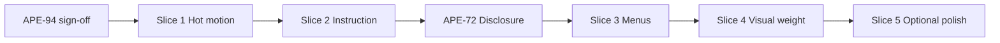

# Packing calm — design pass (captured review + lean execution)

**Parent:** [packing_calm_ux.plan.md](packing_calm_ux.plan.md) · **Discovery:** [packing_calm_ux_discovery.md](packing_calm_ux_discovery.md)  
**North star (unchanged):** Packing shows the next few things to put in the car; everything else is one tap away; nothing shouts unless you’re stuck.

This document **captures** the Emil Kowalski / [neverleft-ui-polish](../.cursor/skills/neverleft-ui-polish/SKILL.md) audit of the **Packing** stage in **Pack** view, and defines **how to reach the goal without over-work**.

---

## Guardrails (avoid over-engineering)

| Rule | Meaning |
|------|---------|
| **Pack mode only** | Do not refactor Full list, kit, or global `.btn` unless a one-line shared fix (e.g. `prefers-reduced-motion` already global). |
| **No new features** | Subtraction, copy, CSS, and small `ciRow` conditionals only — no new settings, flags, or data model. |
| **One loud layer** | Each slice must remove or quiet one competing “shout”, not add UI. |
| **Ship in slices** | Max ~1 focused PR per slice; test on a real phone between slices. |
| **Motion: delete before decorate** | Remove hot-path animation first; only add enter animation to menus if testing asks for it. |
| **Defer the big moves** | Hub collapse-by-default, sticky toolbar (APE-67), consumable logic changes — separate issues after calm baseline. |

**Stop line:** If a slice needs >~80 lines or touches >3 subsystems, split it or defer.

---

## Captured audit (summary)

Full review was run against `tripDetail` → `checklistBody` → `ciRow` and `css/styles.css` (Pack calm). Findings grouped below; detail tables live in chat / can be pasted into Linear APE-71.

### What’s already good

- Unified top **⋯** with list + trip actions ([APE-94](https://linear.app/aperturegraph/issue/APE-94)) — aligns with Phase 4 overflow goal.
- Button `:active` scale on `.btn`, dock FAB, chevrons use explicit transitions (not `transition: all`).
- `checkSettle` disabled under `prefers-reduced-motion`.
- Pack progress line + Pack \| Full seg — cognitive split without a second page.

### Gaps vs north star

| Theme | Problem today | Calm target |
|-------|----------------|-------------|
| **Vertical hierarchy** | Journey + hub + consumable strip + progress + seg + list all compete before row 1 | Title → progress (+ seg) → **list is the stage**; hub/consumables glance-only |
| **Instruction budget** | `ci-tap-nudge` on every row; inline ⚡ + `todo-chip` duplicate | Nudge sparingly; one to-do affordance per row |
| **Hot-path motion** | Whole `.ci:active scale(.97)` + `checkSettle` on every pack tap | Feedback on `.ci-state` only; instant or minimal state change |
| **Overflow language** | Title **⋯**, journey **⋯**, row **•••** look like three systems | One visual pattern for “more” (can be phased) |
| **Ambient weight** | Consumable strip + pack-mode hint always on | Lighter strip; hint only when useful |

---

## Emil review table (reference — do not re-implement blindly)

Use as checklist when implementing slices; pick rows per slice scope.

| Before | After | Why |
| --- | --- | --- |
| Journey + hub + consumable + progress all above list | Default Pack scroll: progress + list dominate; hub/consumable collapsed or visually lighter | One loud layer |
| `ci-tap-nudge` on every row | Nudge on first unchecked in open group only (or focused row) | Instruction budget |
| Inline `⚡ N to-do` in name **and** `todo-chip` | Chip only in Pack mode | Single affordance |
| 9 flat overflow items | Grouped: Pack actions / Trip actions / Delete last | Scannable menu |
| `.ci:active { scale(.97) }` | `:active` on `.ci-state` only in Pack | High-frequency taps |
| `checkSettle` keyframe on pack | Off in Pack (keep reduced-motion rule) | Same |
| `pbar` width `--dur-panel` on every tap | Snap or ~120ms when delta small | Less eye magnet |
| `scrollIntoView({ behavior:'smooth' })` for todo chip | `instant` or `auto` in Pack | Repeated flow |
| `.page.page-enter` on every trip render | Skip when same `tripId` | Hot navigation |
| `consumable-prep` same weight as progress | Muted panel (typography/spacing only) | Calm presentation |
| `pack-mode-hint` always visible | Show once (localStorage) or only in Full list | Rare mode change |
| Three ⋯ styles | Shared class on summary/triggers (size, border) | Cohesion |
| `pack-overflow` `
` no dismiss | Click-outside + Escape (match journey popover) | Invisible quality |
| `.todo-chip:hover` without hover media query | `@media (hover: hover) and (pointer: fine)` | Touch sticky hover |

**Explicitly defer (not in early slices):** popover enter animation, hub tabs collapse-by-default, APE-67 sticky bar, row density redesign, celebration animation rules.

---

## Lean execution plan (slices)

Order is **risk ↑ value first**, **effort ↑ last**. Each slice = one Linear comment / small test plan; mark APE-71 sub-progress in comments, not new issues unless scope explodes.

### Slice 0 — Baseline (done / testing)

**[APE-94](https://linear.app/aperturegraph/issue/APE-94)** — Single top **⋯** (`btn btn-o btn-sm`), list + trip actions; no second list toolbar in Pack.  
**Gate:** User confirms on phone before Slice 1.

### Slice 1 — Hot-path motion (APE-71, ~1 hour) — **ready for testing**

**Goal:** Packing taps feel instant, not “bouncy.”

**Shipped:** `trip-detail--pack-calm` wrapper when Pack mode active; no `.ci:active` scale; `checkSettle` off; `.ci-state:active` scale only; pack progress bar `120ms` width transition.

### Slice 1b — Pack reward (checkbox pop + haptic) — **ready for testing**

**Shipped:** On transition **→ packed** only (Pack mode): `playPackCelebrate` adds `.ci-state--pack-pop` (150ms pop on checkbox); light `navigator.vibrate(12)` once per pack (skipped if `prefers-reduced-motion`). Mark all packed: haptic only, no row pops.

| Change | Files | Acceptance |
|--------|-------|------------|
| Pack only: remove `.ci:active` scale; add subtle `.ci-state:active` scale if any press feedback kept | `css/styles.css` (+ optional `.pack-calm` body class on trip page) | 20 rapid pack taps — no row shrink |
| Pack only: disable `.ci.packed .ci-state` `checkSettle` animation | `css/styles.css` | Mark packed — no bounce |
| Optional: shorten `.pbar-*` transition in `.cprog-pack` only | `css/styles.css` | Bar still updates; less slide |

**Not in slice:** page enter, menu animation, smooth scroll.

### Slice 2 — Instruction budget (APE-71 + APE-74 tidy, ~2 hours) — **ready for testing**

**Goal:** Rows read as items to pack, not a tutorial.

**Shipped:** `packCalmTapNudgeItemIds` — one tap nudge per open location group (+ focused item); no inline ⚡ in Pack; instant scroll to footer to-dos.

| Change | Files | Acceptance |
|--------|-------|------------|
| `checklistStateNudgeHtml` only when row is first unchecked in open `cloc-group` OR `tripTodoFocusItemId` matches | `index.html` `ciRow` | Open garage: one nudge visible, not 8 |
| Pack calm: drop inline `⚡` spans in `.ci-name`; keep `todo-chip` | `index.html` `ciRow` | One teal chip max per row |
| `scrollTripTodosForItem`: `behavior:'auto'` when `packingCalmViewActive` | `index.html` | Chip → footer feels snappy |

**Not in slice:** footer to-do layout changes, new focus ring system.

### Slice 3 — Disclosure defaults (APE-72, ~half day) — **ready for testing**

**Goal:** First screenful = progress + **one** location group.

**Shipped (hybrid, May 2026):** Pack groups by **location**; **multi-open** (jump between places); **auto-collapse only when a group is 100% packed**; first visit opens all groups with work left. Header states: **done** (✓ All packed, muted) vs **todo collapsed** (amber “N to pack”) vs **active** (open, progress bar). Accordion one-at-a-time **reverted**.

| Change | Files | Acceptance |
|--------|-------|------------|
| ~~One-at-a-time accordion~~ | — | **Reverted** — unnatural for multi-location packing |
| Auto-collapse fully packed groups only | `applyPackCalmLocationDisclosure` | Complete Garage → Garage collapses; Kitchen stays open if you left it open |
| Distinct group header states | `cloc-group--done` / `--todo` / `--active` | Done vs still-to-do collapsed are obvious |
| Location grouping in Pack | `checklistBody` | Groups are 📍 locations |

**Depends on:** Slice 1–2 (done).

### Slice 4 — Menu cohesion (APE-69 finish, ~1–2 hours) — **ready for testing**

**Goal:** One “more” pattern; safer menu.

**Shipped:** Menu sections **List** / **Trip** + **Delete trip** last; tap-outside + **Escape** close; journey **⋯** uses shared `overflow-trigger-btn` sizing with trip header.

| Change | Files | Acceptance |
|--------|-------|------------|
| Group `tripOverflowMenuHtml` with labels or dividers: **List** / **Trip** / Delete | `index.html` | Menu scannable in 2s |
| Click-outside + Escape closes `details.pack-overflow` (small listener, no framework) | `index.html` | Tap away closes menu |
| Align `journey-more-btn` size/border with trip **⋯** (CSS only) | `css/styles.css` | Side-by-side looks one family |

**Not in slice:** row **•••** → overflow merge (keep row menu for item actions).

### Slice 5 — Visual weight (APE-71, ~1–2 hours) — **ready for testing**

**Goal:** Less dashboard above the list.

**Shipped:** Muted consumable strip in Pack; Pack/Full hint once (`nlPackModeHintSeen`); flatter unchecked/ready rows (hairline border, minimal shadow).

| Change | Files | Acceptance |
|--------|-------|------------|
| `.consumable-prep` muted variant when `packingCalmViewActive` (smaller type, less border) | `css/styles.css` | Strip readable but not shouting |
| `pack-mode-hint`: show once via `localStorage` key `nlPackModeHintSeen` | `packingViewModeBarHtml` | Repeat visit: no hint |
| Pack calm: slightly flatter `.ci` (reduce shadow) | `css/styles.css` | List feels denser, calmer |

**Defer:** collapse trip experience hub by default (needs UX decision + more JS).

### Slice 6 — Optional polish (backlog)

Only after Slices 1–5 signed off:

- Skip `pageEnter` when navigating to same trip id
- `cprog-complete` celebration once per trip (`localStorage`)
- Popover enter 150ms ease-out from top-right (if users want menu “feel”)
- Row **•••** opacity → full contrast

---

## Mapping to Linear

| Slice | Primary issue | Notes |
|-------|---------------|--------|
| 0 | APE-94 | Ready for testing |
| 1–2, 5 | APE-71 | Split via comments on issue, not new tickets |
| 3 | APE-72 | Unchanged scope; do after Slice 2 |
| 4 | APE-69 | Mostly done via APE-94; finish grouping + dismiss |
| — | APE-67 | **After** 69/71 baseline — sticky bar adds chrome |

**Suggested comment on APE-71:** Link this plan; checklist Slices 1, 2, 5.

---

## Test themes (per slice)

1. **Sunday-night packer** — Demo trip, Pack only, 15 items packed in &lt;2 min without reading hints.
2. **Regression** — Full list unchanged; feature/edit/delete from top **⋯**; dock **+** add; journey **⋯** still works.
3. **Phone** — 375px width; no mis-tap on menus; pack taps feel immediate.
4. **Reduced motion** — OS setting on; no settle animation; app still usable.

---

## Success criteria (epic-level)

- [ ] Pack mode: user can name **one** primary focal area above the list (progress + open group).
- [ ] No duplicate to-do signaling on rows in Pack.
- [ ] Pack taps have no row-scale / settle animation.
- [ ] Top **⋯** is the only list-level power entry in Pack.
- [ ] Full list parity unchanged (explicit regression pass).

When all slices shipped and tested, close **APE-71** and revisit **APE-73** epic Done criteria in [packing_calm_ux.plan.md](packing_calm_ux.plan.md).

---

## What we are **not** doing (anti-scope)

- Rebuilding overflow as a custom React/Radix component
- Spring animations, blur transitions, staggered list enter
- Global `.btn` refactor across the app
- Changing consumable **logic** (APE-55) — presentation only here
- Pack-up / pack-away calm until packing Pack path is signed off
