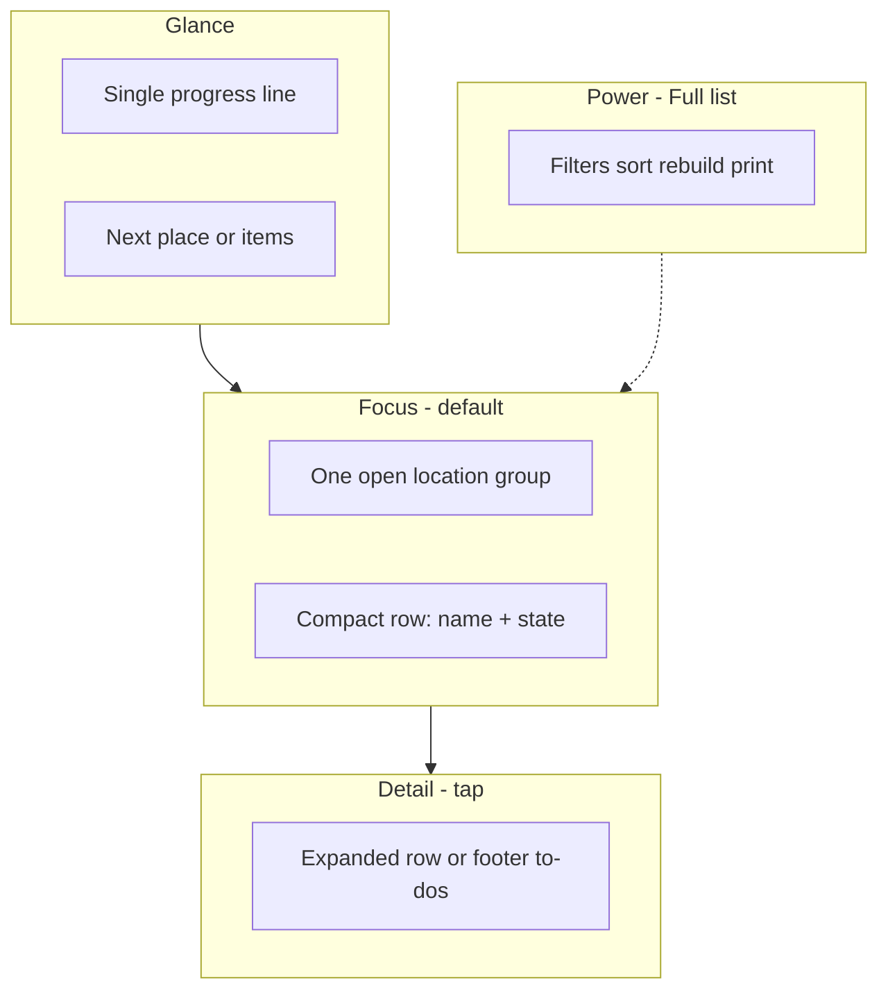

# Packing calm UX — discovery

**Status:** Discovery (May 2026)  
**Parent plan:** [packing_calm_ux.plan.md](packing_calm_ux.plan.md)  
**Linear:** [APE-73](https://linear.app/aperturegraph/issue/APE-73) (epic / discovery)

This document captures why the packing screen feels busy today, what “calm and inspiring” means for NeverLeft, and how progressive disclosure should work before we change `index.html`.

---

## Why this matters

Packing is the **heart of NeverLeft**. Most trips spend their emotional weight here: “Will we forget something? Are we ready? Is it too much?”

If packing reads as a **control panel** (metrics, warnings, filters, duplicate surfaces), the product teaches anxiety. If it reads as a **guided ritual** (what’s next, momentum, reassurance), it teaches confidence.

This is the same philosophy as [trip_experience_hub.plan.md](trip_experience_hub.plan.md) — *experience hub, not inventory dashboard* — applied to the highest-traffic workflow.

---

## North star

> **Packing shows me the next few things to put in the car; everything else is one tap away, and nothing shouts unless I’m actually stuck.**

---

## Philosophy (non‑negotiables)

| Principle | Meaning |
|-----------|---------|
| **One loud layer** | At any moment, one primary question is visible (e.g. “What’s next?”). Metrics, filters, and audit tools stay quiet. |
| **Momentum over debt** | Lead with progress (“18 packed · 6 to go”), not dual percentages and deficit framing. |
| **Progressive disclosure** | Glance → focus → detail → power. Default to glance + focus; never all four expanded. |
| **Reassurance, not surveillance** | Rust/amber alerts only when the user needs to act *now* — not ambient guilt on every row. |
| **Power without clutter** | Search, rebuild, sort, second print, uncheck — always available, rarely visible. |
| **Same data, calmer presentation** | We are not removing capability; we are **sequencing** when it appears. |

### Emotional reframing

| Panicked | Calm / inspiring |
|----------|------------------|
| “Here is your entire obligation” | “Here is **what matters next**” |
| “You are behind” | “You are **closer than you think**” |
| “Configure the list” | “Pack — details when you need them” |
| “Don’t miss subtasks” | “We remember the fiddly bits” |

---

## Current-state audit (packing tab)

What a user often sees in **one scroll** today:

1. Trip toolbar (back, feature, edit, delete)
2. Journey stepper + stage completion pressure
3. Search + filter entry (and overlapping filter UIs)
4. Consumable prep strip (when applicable)
5. “Packing step not finished” gate (persistent rust banner)
6. Progress block: ready %, packed %, remaining, long tap hint
7. Trip highlight count (amber)
8. Six equal-weight toolbar buttons
9. Location-grouped list: every row may show state, name, qty, route, people, notes, inline to-dos, menu, row nudges
10. Footer: full **Before you go** to-do list + notes

**Symptom:** Many simultaneous questions — *Am I done? What’s wrong? What’s next? Where? Who? What subtasks? How do I fix the list?*

**Root cause:** Feature accretion (filters, groups, packable parents, to-dos at bottom + inline, shortfall strip, criteria gate) without a **default cognitive mode**.

---

## Personas (discovery)

### Sunday-night packer (primary)

- Tired, wants **next 3 items**, not a spreadsheet.
- Happy to tick boxes; does not want to learn filter semantics first.
- Success = “car is loaded and I feel ready.”

### List curator (secondary)

- Rebuilds list, sorts by person/location, prints for partner.
- Needs **Full list** mode — must not feel blocked by simplification.
- Success = “list is correct and shareable.”

### Anxious first-timer

- Overwhelmed by long lists and red/amber UI.
- Needs **one coaching line** and obvious “you’re doing fine” progress.
- Success = “I didn’t panic and I didn’t forget the obvious.”

---

## Progressive disclosure model

Four levels — only **one** should feel “loud” at a time:

```text
1. GLANCE (always)
   One progress story + optional “next place” or “next 1–3 items”

2. FOCUS (default work)
   Compact rows; one location group open; hide packed default on

3. DETAIL (on demand)
   Expanded row: route, people, notes; or scroll to footer to-dos

4. POWER (rare)
   Search, sort, filters, rebuild, uncheck, both prints — Full list mode or ⋯ menu
```



---

## Proposed product direction: **Pack** vs **Full list**

| | **Pack** (default) | **Full list** |
|--|-------------------|---------------|
| **Job** | Put things in the car | Curate, audit, share |
| **Progress** | One line (“24 packed · 6 left”) | Full metrics optional |
| **Rows** | Compact; expand for detail | Today’s density OK |
| **Groups** | One incomplete location open | User controls all groups |
| **To-dos** | One default surface (see below) | Both surfaces + prints OK |
| **Toolbar** | + Add primary; rest in ⋯ | Full toolbar |
| **Filters** | Hidden | Search + sort + filter panel |

Mode switch: **segmented control directly under the progress bar**, above toolbar and list — **not** in the journey stepper or trip sub-nav.

**Persistence:** `localStorage.nlPackingViewMode` = `pack` | `full`; default **`pack`** for new users.

**Important:** Pack and Full list share the **same trip page**. Trip details, weather, consumable/shopping prep strip, stepper, stage buttons, footer to-dos, and notes are **always shown**. Only the checklist list chrome (progress style, filters, toolbar, row layout) changes.

---

## To-dos: one default surface

Users asked for both **inline** (context while packing) and **bottom list** (see everything). Calm default:

| Option | Default in Pack mode | Full list |
|--------|----------------------|-----------|
| **A — Bottom master** | Rows show chip “2 to-dos”; bottom list is master | Inline + bottom as today |
| **B — Inline master** | Inline only; “See all to-dos” jumps to footer | Same |
| **C — User preference** | Setting: “To-dos on rows / in list below / both” | Unrestricted |

**Resolved (May 2026):** **Option A** in Pack mode. Option C (user preference) deferred post-v1. Full list keeps inline + bottom.

---

## Instruction & warning budget

**Rule:** Maximum **one** persistent coaching line on Pack mode.

| Element | Pack mode | Full list |
|---------|-----------|-----------|
| Criteria gate banner | Only on “Packing done” attempt | Can show earlier if needed |
| Progress hint paragraph | Short single line | Full hint OK |
| Per-row ⚡ counts | Only when ready/packed but to-dos incomplete | Optional all rows |
| Footer to-do hint | One short line | As needed |

---

## Visual calm (later phase)

- Fewer uppercase / mono stats on every row.
- Amber/rust reserved for **action required now**.
- More whitespace between **sections** (progress · list · to-dos), less noise inside rows.
- Celebrate **location group complete** (existing “All packed”) — lean into completion, not new metrics.

---

## Out of scope (this initiative)

- Replacing the journey stepper with tabs ([APE-52](https://linear.app/aperturegraph/issue/APE-52) — related but separate).
- Requiring venue/booking before packing.
- Removing location grouping or print flows.
- Count-aware partial packing ([APE-56](https://linear.app/aperturegraph/issue/APE-56)) — orthogonal.

---

## Related work

| Item | Relationship |
|------|----------------|
| [trip_experience_hub.plan.md](trip_experience_hub.plan.md) | Same progressive-disclosure philosophy on trip **detail** |
| [trip_todo_print.plan.md](trip_todo_print.plan.md) | Print stays in power layer; Pack mode may expose one print entry |
| [APE-52](https://linear.app/aperturegraph/issue/APE-52) | Stepper, completion, undo — journey-level calm |
| [APE-67](https://linear.app/aperturegraph/issue/APE-67) | Sticky toolbar — only after toolbar is thinned (Phase 4) |

---

## Discovery outputs (done / next)

- [x] Problem framing + north star + disclosure model (this doc)
- [x] Phased implementation plan + Linear breakdown ([packing_calm_ux.plan.md](packing_calm_ux.plan.md))
- [x] Open questions resolved — see plan **Resolved decisions** table
- [x] Pack-mode mock — [`NeverLeftClaudeDesign-pack-mode.html`](../NeverLeftClaudeDesign-pack-mode.html) (interactive Pack / Full list)
- [ ] 15-minute walkthrough with Sunday-night packer script — note friction points

---

## Resolved decisions

See [packing_calm_ux.plan.md](packing_calm_ux.plan.md) **Resolved decisions** for the full table. Summary:

1. **Toggle** — under progress, segmented Pack | Full list.
2. **Hide packed** — always on in Pack mode (not togglable there).
3. **Auto-advance** — yes: next incomplete location opens when current group completes.
4. **v1 scope** — packing checklist only; pack-up / pack-away later.
5. **To-dos** — Pack: bottom master + row chip; Full list: inline + bottom.
6. **Gate banner** — only on failed “Packing done”, not mid-scroll.
7. **Progress** — one packed-first line in Pack mode.
