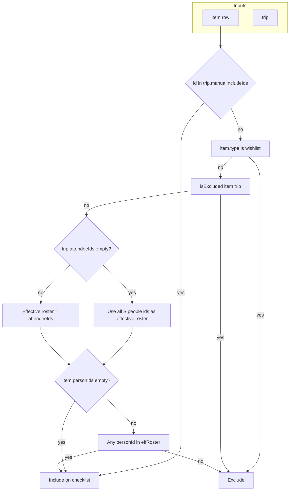

# Trip attendees and checklist scoping

## Current behavior (baseline)

- [`index.html`](index.html): Items use `personIds` (global assignment). Trips store `dog`, `extraPeople`, etc., but **no per-trip roster**.
- [`genChecklist` / `hardRegenChecklist`](index.html) (~2374–2395): `included = S.items.filter(i => i.type !== 'wishlist' && !isExcluded(i, trip))` — **every** eligible inventory line becomes a checklist row; person assignment does not affect inclusion.
- [`isExcluded`](index.html) (~1082–1091): Handles wishlist, **dog category** via `trip.dog`, season, activity — not person overlap.
- Checklist **person filter** (~1751–1757, ~1830–1833): Filters display only; pills list **all** `S.people`.

## Proposed data model

- Add **`trip.attendeeIds: string[]`** (IDs from `S.people`, e.g. demo includes Biscuit as a person with `dogId`).
- **Backward compatibility**: If `attendeeIds` is missing or empty on load, treat as **“whole crew”** — same effective set as today (all current `S.people` ids), so existing localStorage/backups behave unchanged until the user edits the trip.
- Keep **`trip.dog`** for [`isExcluded`](index.html) dog-**category** lines that may have empty `personIds`. Define a single rule in the trip modal: toggling dog kit updates **`trip.dog`** and, if the dog exists as a `S.people` row, **adds/removes that id from `attendeeIds`** so person-assigned dog items and category rules stay aligned.

- Add **`trip.manualIncludeIds: string[]`** (inventory `item.id` values). These rows are **always merged into** the generated checklist set for that trip, **bypassing** [`isExcluded`](index.html) **and** attendee / person-overlap rules for those ids only. Global `personIds` on the item are **not** edited—this is trip-scoped only.
- **Backward compatibility**: Missing or empty `manualIncludeIds` → no manual rows (same as today).
- **Wishlist**: Keep **out** of manual includes (picker only lists non-wishlist inventory, or filter server-side) so “shopping list” lines do not pollute trip packing unless you later add an explicit product decision.

**`extraPeople`**: Keep as optional **unrostered headcount** (guests); document that it does not auto-multiply checklist rows today (same as now). Optionally show a short hint in the trip modal so it is not confused with named attendees.

## Core rule: “on this trip’s checklist” (automatic set)

Central helper (name illustrative), used by `genChecklist`, `hardRegenChecklist`, and any “reconcile checklist after trip edit” path:

- **Sub-items** with their own `personIds`: evaluate the **sub** line’s ids (same pattern as checklist filtering today with `ownIds` vs parent inheritance in [`checklistVisibleSubsForRow`](index.html) / [`ciRow`](index.html)).
- **Containers**: Include the parent row if **any** child (non-excluded **or** in `manualIncludeIds`) would be included, so empty-parent / assigned-children cases still render (mirrors progress logic that skips empty container parents in [`checklistProgressCIs`](index.html)). If a **forced** line is a **sub-item**, ensure its **parent** container row is also present on the checklist so existing [`ciRow`](index.html) nesting still works (auto-add parent id when adding a child to `manualIncludeIds`).

**Final generated set**: unique union of **automatic** ids (flow above) and **manual** ids (still must resolve to existing `S.items` rows; ignore unknown ids on load / regen with optional dev console warning).

## Trip-level manual includes (inventory overrides)

**User goals** (same feature set):

- Bring kit **assigned to someone not on this trip** for this trip only.
- Bring **one** seasonal / activity / dog-gated line without turning on the whole category or changing trip season/activities.
- Any other case where automatic rules are too broad—**explicit** per-trip exception list.

**Behavior**:

1. **Picker UI** (e.g. from packing checklist toolbar next to existing “+ Quick add item” in [`checklistBody`](index.html) ~1903–1907): “**+ From inventory**” opens a modal: searchable list of kit lines (reuse patterns from global search or My Kit rendering). Selecting items appends their ids to `trip.manualIncludeIds` (dedupe), then **merges** new checklist rows (`unchecked`) for any id not already on `trip.checklist`.
2. **Regenerate / rebuild**: `manualIncludeIds` is **preserved** on the trip object; each `genChecklist` / `hardRegen` run recomputes `automatic ∪ manual` so overrides survive rebuilds. `hardRegen` resets **states** for all rows (current product behavior); if you want manual rows to keep state on full regen, call that out as a product tweak (default: match existing “full reset” semantics).
3. **Remove override**: Offer “Remove from this trip” for rows whose `itemId` is in `manualIncludeIds` (removes id from array and drops checklist row unless the item is still in the **automatic** set). Prevents stale ids if an inventory item is deleted—prune missing ids on save/regen.
4. **Visual hint**: Optional small badge on checklist rows sourced only from manual include (e.g. “Extra for this trip”) so users remember why a line appears despite roster/season.
5. **Search / “on trips”**: [`searchAll`](index.html) should treat an item as on a trip if it appears on `trip.checklist` **or** is in `manualIncludeIds` (after merge logic is canonical, checklist membership is enough if regen always merges manual ids first).

**Explicit non-goals for this slice** (clarifies prior plan wording):

- Manual include does **not** change `S.items[].personIds` or inventory type/category—only trip checklist membership.
- Trip-specific **re-assign who owns an item** remains out of scope unless added later.

## Checklist lifecycle when attendees change

- Reuse the existing pattern after trip save: if checklist exists and trip config changed, prompt to **regenerate** (already near [`saveTrip`](index.html) ~3059–3065). Changing **`manualIncludeIds`** can merge immediately without wiping automatic set—or use the same confirm if you want one consistent UX.
- Prefer a **merge** in `genChecklist` (like current preserve-state map keyed by `itemId`): **add** rows for newly included items, **remove** rows for items no longer in `automatic ∪ manual`, **keep** `state` / `actionStates` keys where `itemId` still applies; prune `trip.actionStates` keys for removed item ids (same family as [`clearActionTicksForChecklistItems`](index.html)).

## UI / UX touchpoints (single file today)

| Area | Change |
|------|--------|
| Trip modal ([`#tripModal`](index.html) ~850–880, [`openNewTripModal` / `openEditTripModal` / `saveTrip`](index.html)) | Multi-select toggles for each `S.people` entry + keep “Dog kit” checkbox; wire `attendeeIds` + `dog` sync. Empty selection = “whole crew” or block save with validation — **recommend**: require at least one attendee **or** explicit “Everyone” toggle to avoid ambiguous empty state. |
| Trip list hero [`peopleAvatars`](index.html) ~1452–1457 | Show **effective roster** avatars, not all `S.people`. |
| Trip detail subtitle [`tripDetail`](index.html) ~1566–1573 | Build crew string from **attendees** (and dog flag copy if useful), not global list. |
| Checklist person filter (~1723–1727, ~1830–1833) | Offer pills for **attendees on this trip** (plus “Everyone”); optionally hide people not on trip to avoid confusion. |
| Checklist toolbar ([`checklistBody`](index.html) ~1903–1907) | **+ From inventory** modal → updates `manualIncludeIds` + checklist merge. |
| Global search [`searchAll` onTrips](index.html) ~3128–3138 | When deciding an item is “on” a trip, apply the **same inclusion helper** as `genChecklist` (checklist rows already reflect manual merges once implemented). |
| Backup restore trip migration ([`import` trip map](index.html) ~4001–4024) | Map `t.attendeeIds` and `t.manualIncludeIds` with defaults `[]`; prune invalid item ids on restore. |
| Demo seed [`demoData` trip](index.html) ~4691+ | Set `attendeeIds` to the full demo family (+ dog); `manualIncludeIds` can stay `[]` or include one demo override as documentation. |

## Other considerations (non-obvious but important)

1. **Multi-person items** (e.g. `personIds: [dadId, mumId, ...]`): Include if **any** assigned id is on the trip (intersection non-empty); exclude only if none match—unless id is in **`manualIncludeIds`** (then include regardless).
2. **Orphan checklist rows**: After shrinking the roster or removing manual ids, rows for removed items should disappear from storage, not only from the filter — avoids stale `actionStates` and ghost progress.
3. **Quick add** ([`saveQuickAdd`](index.html)): New items default `personIds: []` (shared) → always appear in automatic set; no need to add to `manualIncludeIds` unless you want them tagged as override (optional: skip tagging).
4. **`checklistProgressTotals` / print** ([`printChecklist`](index.html) ~4294+): Totals already derive from checklist rows; after generation is correct, progress and print stay consistent. Update printed **meta chips** if they should list named attendees instead of only `extraPeople`.
5. **Pack-up / pack-away / post-trip** views: Confirm any code paths that assume “all checklist itemIds exist in inventory” still hold after pruning (grep for `trip.checklist` usage when implementing).
6. **Global item fields unchanged**: `personIds`, season, and category on inventory stay as today; trip **only** filters automatic rows and holds **`manualIncludeIds`** for exceptions.

## Implementation order (suggested)

1. Add `itemIncludedForTrip(item, trip)` (and container-aware wrapper) + **`tripIdsIncludedAutomatic(trip)`** vs full **`tripIdsIncludedAll(trip)`** that unions `manualIncludeIds` + parent fix-up for forced subs.
2. Wire `genChecklist` / `hardRegenChecklist` to use the full set with merge/preserve state and action-state pruning.
3. Trip modal + `saveTrip` + migration + demo trip (`attendeeIds`).
4. **Inventory picker** + `manualIncludeIds` persistence + remove-from-trip + optional row badge.
5. Update `peopleAvatars`, `tripDetail` subtitle, checklist person pills for active trip.
6. Align `searchAll` onTrips with the final inclusion / checklist membership rules.
7. Manual pass: roster change + manual include / remove + regen + dog/season edge cases.
