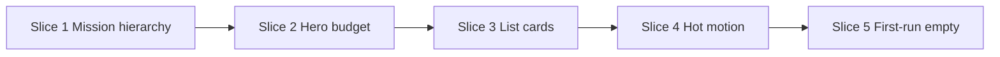

# Trips home — calm audit (mission-driven)

**Scope:** `#pg-trips` / `renderTrips()` when no `activeTripId` — the first screen after intro/orientation (dock **Trips** tab).  
**Not in scope:** Trip detail (`tripDetail`), Kit, Want, Settings, modals (separate passes).

**Parent context:** [packing_calm_ux.plan.md](packing_calm_ux.plan.md) · [packing_calm_design_pass.plan.md](packing_calm_design_pass.plan.md) (methodology)  
**Discovery reference:** [packing_calm_ux_discovery.md](packing_calm_ux_discovery.md) (personas, emotional job)

---

## North star (Trips home)

**Emotional job:** *“I opened NeverLeft and I immediately know what trip matters — I’m not reading a dashboard.”*

**One sentence:** The home screen shows **one clear next trip** and **one obvious open action**; everything else (filters, logbook, ideas, editorial copy) stays visually quieter.

**Success feels like:**

- First-time (empty): warm invitation, single CTA, no admin chrome.
- Returning user: eyes land on **Next up** hero → **Open trip** without scanning five labels first.
- Power user: filters and secondary lists still there, but they don’t shout over the hero.

---

## Editorial voice & warmth (non‑negotiable)

**Calm ≠ sterile.** NeverLeft should still feel like a well-edited trip notebook — warm, human, serif-accented — not a utility dashboard.

| Guardrail | Meaning |
|-----------|---------|
| **Voice budget** | On every non-empty Trips home view, keep **at least one** warm line with Newsreader `<em>` (packing phrase, forecast nudge, or section intro). |
| **Relocate, don’t sterilise** | Remove **duplicate** metrics (%, bar, fraction), not personality. Human phrases move to editorial **or** hero subline — never nowhere. |
| **Hierarchy ≠ silence** | Demote admin chrome (`My Trips` shout, date eyebrow on phone); **promote** editorial as the friendly page voice (parallel to Kit `kit-intro`). |
| **One narrator at a time** | Editorial + hero: editorial = horizon + human aside; hero = numbers + CTAs. Same story told once per register (words vs metrics). |
| **Empty / first trip** | Slice 5 must feel **more** inviting, not more minimal. |
| **Review gate** | After each slice: *“Does this still feel like NeverLeft?”* — not only *“Is it calmer?”* |

**Sweet spot**

| Too messy | Target | Too clean |
|-----------|--------|-----------|
| Editorial % + hero bar + status pill | Editorial: *“3 trips on the horizon — Brecon is just getting started.”* Hero: countdown + pack block | *“3 trips”* + flat cards, no serif |

**Typography anchors (keep):** Familjen Grotesk headlines · Newsreader italic in `.trips-editorial em` · DM Mono eyebrows (`trips-home-eyebrow`, `trips-next-label`, section labels).

---

## User moments (audit against)

| Moment | What they need | Risk today |
|--------|----------------|------------|
| **First land** (post-intro, demo trip) | Confidence + one next step | Empty state is fine; with data, hero + editorial + filters compete |
| **Daily open** (packing trip exists) | Open that trip fast | Hero hover lift + pulse + `page-enter` on tab = motion noise |
| **Planning season** (3+ upcoming) | See focus trip + skim others | Hero OK; “Also planned” intros + per-row status pills add scan cost |
| **Ideas only** filter | Dreaming mode, lighter chrome | Filter works; editorial still talks “horizon” / packing % |
| **Logbook** | Past trips, de-emphasised | Section is appropriately quieter (`tcard--logbook`) — **keep** |

---

## What’s already good (keep)

- **Hero card** (`renderTripHeroCard`) — strong focal point: title, meta, roster, countdown + pack progress columns on wide screens.
- **“Next up” label** (`trips-next-label`) — orients before the hero.
- **Filter chips** (`trips-filter` / `trips-filter-btn`) — same family as `fb`; clear All / Trips / Ideas.
- **Logbook separation** — border-top, muted cards, italic intro; feels like archive, not the main stage.
- **Featured trip** — hero pill + list star; power feature without a settings screen.
- **Dock + FAB** — create path is discoverable; Trips tab badge for count (if used).
- **Responsive hero grid** — `@media (min-width: 900px)` three-column layout reads well on iPad after journey-bar fix.
- **Reduced motion** — hero pulse and hover lifts already disabled in `prefers-reduced-motion` block in `styles.css`.

---

## Gaps vs north star

| Theme | Problem today | Calm target |
|-------|----------------|-------------|
| **Hierarchy** | `My Trips` + date eyebrow + large editorial + filters + Next up + hero internals all read as “headlines” | **One** primary line (editorial *or* “Next up”, not both at equal weight) |
| **Instruction budget** | Hero shows status pill, featured pill, weather (×2), countdown, **and** 3-line pack stats **and** editorial may repeat pack % | Hero = metrics; editorial = horizon + **one human `<em>` clause** (no raw % when hero shows progress) |
| **Hot-path motion** | `.trip-hero:hover` lift; countdown pulse; `page-enter` on every dock return to Trips | Press feedback on buttons only; pulse off or ≤7 days; no page-enter on trips tab re-focus |
| **List density** | `.tcard:hover` lift + amber ring; status pill + fraction + star per row | Flatter cards (like Pack calm rows); status as text or single chip |
| **Implementation** | `renderTripListCard` uses inline styles; duplicates avatar markup vs hero | CSS classes; shared roster/avatar component |
| **Empty / first trip** | Inline-styled empty block in `renderTrips` | Reuse intro tone; match `kit-intro` pattern for consistency |

---

## Emil review table (Trips home)

| Before | After | Why |
| --- | --- | --- |
| `trips-heading-title` “My Trips” + `trips-editorial` both loud | Eyebrow “My Trips” + editorial as page voice; editorial type smaller than hero title | One loud layer; warmth preserved |
| `trips-date-eyebrow` always visible | Hide on narrow viewports; show from tablet up | Date rarely changes trip choice |
| `tripsEditorialHtml` repeats hero % | Keep human packing phrase in `<em>`; drop numeric % when hero shows progress block | Words vs metrics — not silence |
| Hero: status pill + featured + weather + countdown + pressure frac + bar | Hero: title, meta, roster, **one** metric block (countdown **or** progress, not both shouting) | Hero is the stage, not a dashboard panel |
| `trip-hero-countdown--pulse` always when pressure mode | Pulse only if leaves in ≤7 days; else static | High-frequency return users see pulse constantly |
| `.trip-hero:hover { translateY(-3px) }` | Hover lift only `@media (hover:hover)`; `:active` scale on card optional | Whole-card hover on every visit feels bouncy |
| `setTab('trips')` adds `.page-enter` every time | `page-enter` only when `pg-trips` was hidden (first show), not dock re-tap | Tab switching is high frequency |
| `.tcard:hover` lift + 2px amber ring | Flatter shadow; hover lift desktop-only; `:active` subtle scale | Align with Pack calm list feel |
| List row: star + status pill + packed fraction | Star remains; status → muted text or one chip; fraction only if packing | Reduce right-column stack |
| Empty state inline `style=` block | `.trips-empty` component styles in CSS | First impression polish + maintainability |
| `+ New trip` in heading only | Keep; ensure FAB sheet duplicates aren’t the only path on mobile | OK to have two entry points if hierarchy clear |

---

## Animation decision (Trips home only)

| Element | Frequency | Verdict |
|---------|-----------|---------|
| Dock → Trips tab | Daily | **No** `page-enter` on repeat |
| Open trip (hero / list tap) | Daily | **No** card hover lift; optional light `:active` |
| Hero countdown pulse | Weekly+ | **Rare** trigger only (imminent departure) |
| Filter chip toggle | Occasional | CSS color/border only (already fine) |
| First visit after intro | Once | Soft hero enter OK if `prefers-reduced-motion` respected |

---

## Lean execution plan (slices)

Order: **value first**, **subtraction before decoration**. Max ~1 PR per slice; test phone + iPad.

### Slice 1 — Mission hierarchy (~2–3 hours) — **ready for testing**

**Goal:** Top of screen answers “what matters?” in &lt;2 seconds **without** losing editorial warmth.

| Change | Files | Acceptance |
|--------|-------|------------|
| Kit-style head: `trips-home-eyebrow` + editorial; `+ New trip` in same row | `index.html`, `css/styles.css` | One friendly voice line; admin chrome demoted |
| Date eyebrow desktop-only (`.trips-date-eyebrow--desktop`) | `css/styles.css` | Mobile: no extra headline above editorial |
| `tripsEditorialHumanPhrase` when hero shows progress — no `%` in editorial | `index.html` `tripsEditorialHtml` | Warm `<em>` kept; hero owns numbers |
| Editorial type scale below `.trip-hero-title` | `css/styles.css` `.trips-editorial` | Clear parent → child relationship |

**Not in slice:** renaming “My Trips”, new illustrations.

**Shipped (May 2026):** `trips-home-head`, editorial voice guardrails in `tripsEditorialHtml`, CSS hierarchy.

### Slice 2 — Hero instruction budget (~2–3 hours)

**Goal:** Hero feels like **one trip card**, not three widgets.

| Change | Files | Acceptance |
|--------|-------|------------|
| Collapse metrics on mobile: countdown **or** progress prominent, not both at full volume | `css/styles.css` `@media (max-width: …)` | Phone: less vertical stack fatigue |
| Gate `trip-hero-countdown--pulse` (e.g. ≤7 days) | `index.html` `heroCountdownBlock` / `pressureCountdown` | No eternal pulse |
| Weather chip: one placement; don’t duplicate mobile in actions if desktop shows | `renderTripHeroCard` | Cleaner action row |
| Optional: demote status pill copy (“Planning · on the horizon” → shorter) | `tripHeroStatusPill` | Less label noise |

**Not in slice:** redesign hero grid, remove deco tent.

### Slice 3 — List cards (~2 hours)

**Goal:** Secondary trips readable but calmer than hero.

| Change | Files | Acceptance |
|--------|-------|------------|
| Move `renderTripListCard` inline styles → `.tcard-*` classes | `index.html`, `css/styles.css` | Matches maintainability standard |
| Flatter `.tcard` (hairline border, less shadow); hover lift desktop-only | `css/styles.css` | Parity with Pack calm unchecked rows |
| Right column: prefer one status affordance (hide fraction on mobile?) | `renderTripListCard` | Less visual stack on narrow width |

**Not in slice:** swipe actions, new card layout.

### Slice 4 — Hot-path motion (~1 hour)

**Goal:** Returning to Trips feels instant.

| Change | Files | Acceptance |
|--------|-------|------------|
| `setTab`: `page-enter` only when trips page was `display:none` | `index.html` `setTab` | Dock Trips→Kit→Trips doesn’t fade whole page |
| `.trip-hero:hover` behind `(hover:hover)` only (verify) | `css/styles.css` | Touch devices: no card jump |
| `.tcard:active` keep subtle; no `:hover` lift on touch | `css/styles.css` | Consistent with Slice 3 |

**Not in slice:** scroll restoration, hero enter animation.

### Slice 5 — First-run & empty (~1–2 hours)

**Goal:** Zero-trip and single-trip demos feel intentional.

| Change | Files | Acceptance |
|--------|-------|------------|
| `.trips-empty` styled like intro tone (not raw inline styles) | `index.html`, `css/styles.css` | Empty state matches brand |
| With one trip: consider hiding filter bar until 2+ horizon trips | `renderTrips` conditional | Less chrome for new users |

**Not in slice:** onboarding tour changes.

---

## Guardrails (avoid over-engineering)

| Rule | Meaning |
|------|---------|
| **Trips home only** | Don’t refactor trip detail, Pack mode, or global `.btn` unless one-line shared fix. |
| **No new features** | No new widgets (weather, kit stats on home, etc.). Subtraction + CSS + small copy. |
| **One loud layer** | Each slice removes a competing shout. |
| **Editorial voice** | See [Editorial voice & warmth](#editorial-voice--warmth-nonnegotiable) — never ship a slice that feels like a banking app. |
| **Don’t merge hero + list** | Hero stays card; list stays list — don’t build a single mixed feed. |
| **Preserve logbook** | Keep archive section visually secondary. |

**Stop line:** &gt;~100 lines or trip-detail touch → split/defer.

---

## Cohesion with packing calm (reuse, don’t re-litigate)

| Packing calm pattern | Trips home application |
|----------------------|-------------------------|
| One instruction per surface | One editorial line; hero = progress + CTA |
| Flatter list rows | `.tcard` matches `.ci:not(.packed)` calm |
| Menu / dismiss patterns | N/A on home (no overflow menu yet) |
| `prefers-reduced-motion` | Extend existing global block |
| localStorage “seen once” hints | Optional later: “filter help” — **defer** |

---

## Linear / tracking (suggested)

| Item | Suggestion |
|------|------------|
| Epic | [APE-110](https://linear.app/aperturegraph/issue/APE-110) — Trips home calm UX |
| Slice 1 | [APE-111](https://linear.app/aperturegraph/issue/APE-111) — Ready for testing |
| Issues | One issue per remaining slice (2–5) — backlog |
| Plan | This file = source of truth |

Do **not** mark Done until phone + iPad sign-off per slice (same workflow as packing calm).

---

## Out of scope (explicit deferrals)

- Trip detail / journey / pack screens (separate plans).
- Kit home `kit-intro` parity beyond empty state (optional follow-up: **Kit home calm**).
- Global chrome audit (dock, sheets) — recommended **before** or **parallel** as [mobile_shell_field_nav.plan.md](mobile_shell_field_nav.plan.md) follow-up.
- Featured-trip education (first-time tooltip) — nice-to-have.
- Sticky trips header — see APE-67 pattern on detail lists only.

---

## Quick test checklist (after any slice)

1. Fresh profile: intro → orient → land on Trips with demo data — what draws the eye first?
2. iPhone: scroll home — hero → list; no clipped dots/pills.
3. iPad landscape: hero grid + full-width steps (journey is on detail, not home — N/A here).
4. Filter: Ideas / All / Trips — empty messages still sane.
5. Dock: Trips → Kit → Trips — no full-page flash.
6. Tap hero vs list card — both open trip; star doesn’t mis-tap.

---

## Summary

Trips home is **strong structurally** (hero + sections + filters) but **over-explains** compared to the packing calm north star. The highest-impact work is **subtracting competing headlines and duplicate progress copy**, then **calming motion on the daily path**, then **list card polish** for consistency with Pack mode.

Recommended start: **Slice 1 (mission hierarchy)** — smallest conceptual change, largest clarity gain for first-time and daily opens.
